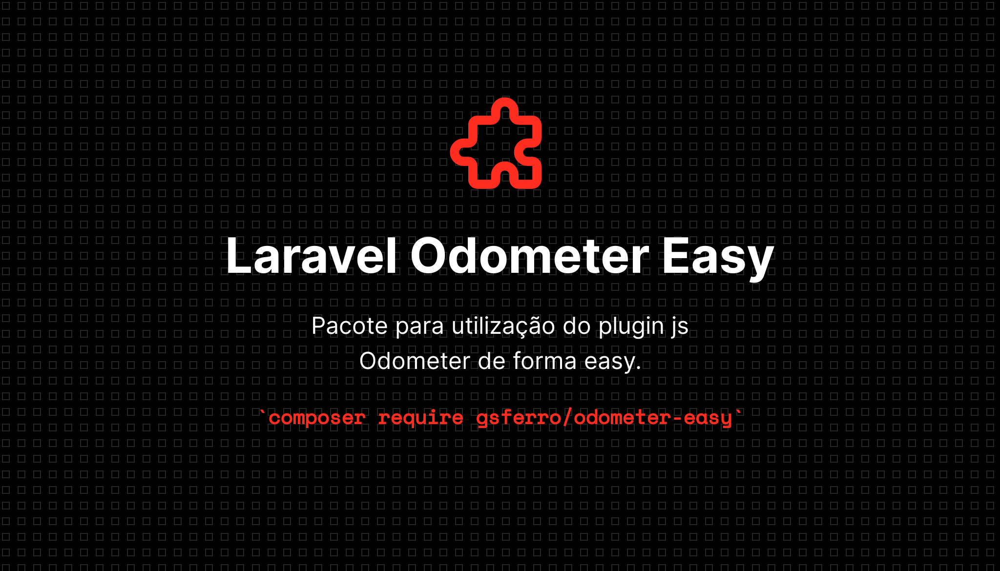

### Instalação

```composer 
composer require gsferro/odometer-easy && php artisan vendor:publish --provider="Gsferro\OdometerEasy\Providers\OdometerEasyServiceProvider" --force
```

### Uso

- Chamada basica com o `$value` sendo uma variável
    ```html 
    <x-odometer-easy :value="$value" />
    ```

- Passando uma class extra
    ```html 
    <x-odometer-easy :value="$value" class="h3" />
    ```

- Passando um valor fixo 
    ```html
    <x-odometer-easy value="1000" />
    ```
  
- Passando um format (default é money BR, ex: 1.000,00)
    ```html
    <x-odometer-easy
        value="1000,00"
        format="<veja as opções na documentação oficial abaixo>" 
    />
    ```
  
### Requisitos

> Jquery
 

### Observações Gerais
1. O componente foi feito pensando no **Laravel 8**, porém da para utilizar alterando o componente manualmente:
    ```html 
    <span id="{{ $key }}" class="odometer-item {{ $class ?? "" }}" data-value="{{ $value ?? 0 }}">0</span>
    ```
1. Como default esta a animation count para poder utilizar tantas quantas vezes quiser na tela, sem ele, ocorria delay ao utilizar em +10 lugares na tela.  
1. Para aumentar a fonte, encapsule o componente e utilize classes para para aumentar a fonte 
1. Ainda não é possivel atualizar dinamicamente o valor após o loading do componente, caso queira atualizar na tela, será necessário executar manualmente a instancia:
    ```html
    <span id="odo">0</span>
    ```
    ```js
    var odo = new Odometer( $('#odo') );
    value=100;
    odo.update( value );
    value+=100;
    odo.update( value );
    ```

### *TODO*

1. Alterar dinamicamente o valor apos instancia do plugin
1. Criar outros componentes para usar o thema de texto
1. Criar formatação BRs (CPF / CNPJ / CEP)
    ```html 
    <x-odometer-easy value="123.456.789-10" format="(.ddd)-dd" animation="false" />
    ```
1. Possibilitar instalação em versões antigas do Laravel

### Link Docs Odometer:

> https://github.hubspot.com/odometer/

### Exemplo Plugin Puro

> http://jsfiddle.net/adamschwartz/rx6BQ/

### License

- MIT License